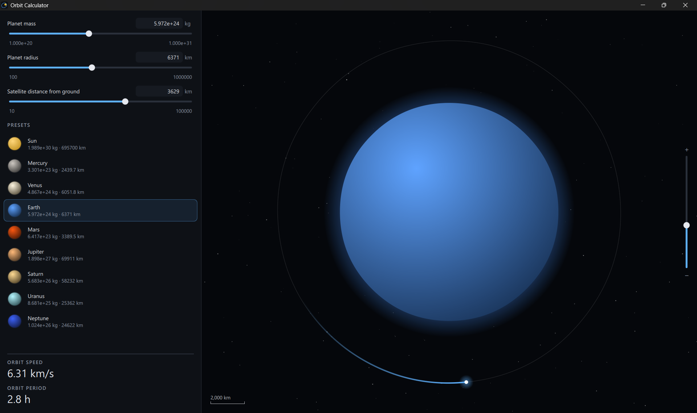
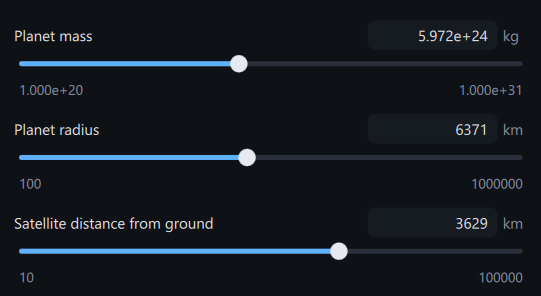
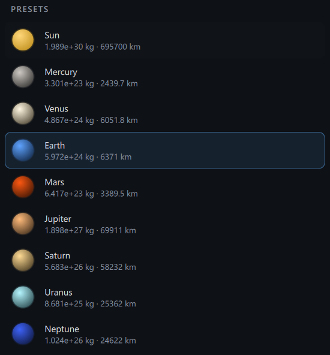
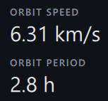
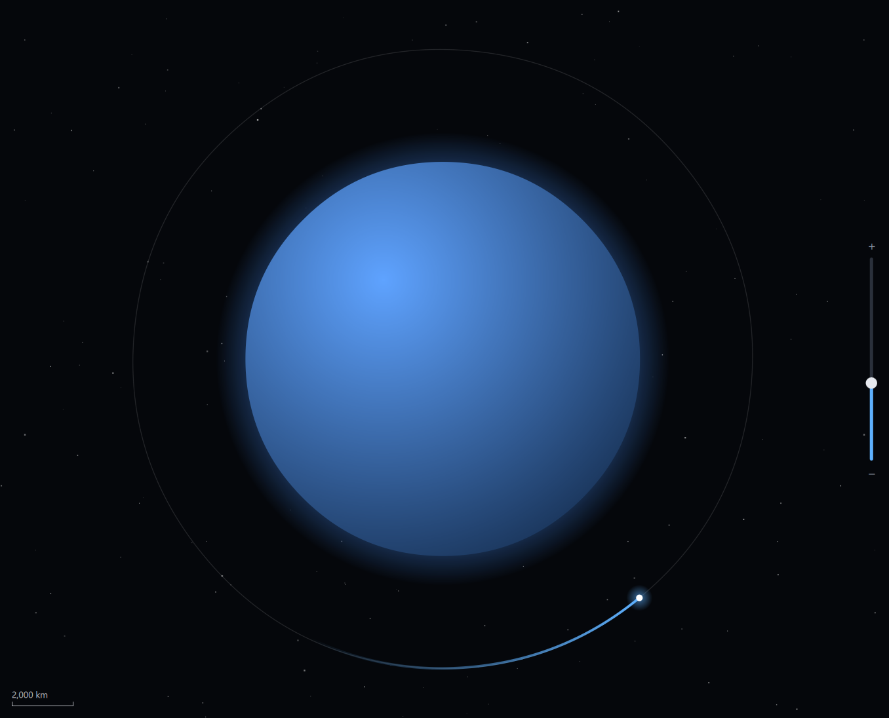

# **Orbital Calculator**

An interactive satellite orbit visualizer app.



<br>

## **Table of Contents**

1. [Prerequisites](#prerequisites)
2. [Installation](#installation)
3. [Features](#features)

<br>

## **Prerequisites**

* Python 3.12.10
* Pip (Python package manager)

<br>

## **Installation**

1. Set up virtual environment, enter, and install requirements.

    **Windows**

    ```bash
    python -m venv .venv
    .\.venv\Scripts\activate
    pip install -r requirements.txt
    ```

2. Run app.

    ```bash
    python .\src\main.py
    ```

<br>

## **Features**

| **Feature** | **Screenshot** |
|---|---|
| - Input planet mass <br> - Input planet radius <br> - Input orbite height from ground |  |
| - Planet orbit presets |  |
| - Orbit period calculation <br> - Orbit speed calculation |  |
| - Zoom in/out <br> - Dynamic scale <br> - Orbit and celestial body visual |  |

<br>

---

*Last updated: 9/28/2026*